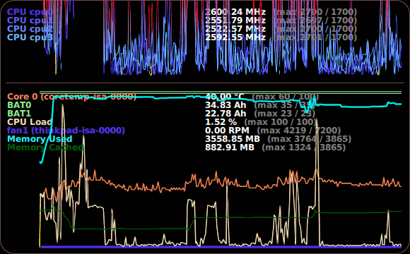

# qqchart
GPU-powered line charts in Qt Quick



The holy grail is to be able to send raw data to the GPU and have it
draw a line graph, without needing much preparation on the CPU side
(other than having it in time-ordered form, which comes naturally).

Of course it's still pretty far from that.  So far I have to pad out
a vertex array to send over, and then the GPU can rearrange the vertices
to achieve an antialiased line rendering.

But I can monitor my system sensors with a pretty low CPU usage, anyway.

To try it out:
```
qmake; make
qml -I . examples/sensor-summary-desktop-widget.qml
```

To install:
```
make install
```

You can then use it in your own QML scripts:
```
import org.ecloud.charts 1.0
```

Issues

- [ ] data with sharp spikes renders "ghostly", shimmering, coming and going...

Incomplete features

- [ ] InfluxDB as a datasource (not started)
- [ ] labels, grids and tickmarks (see the axis-labels branch)

